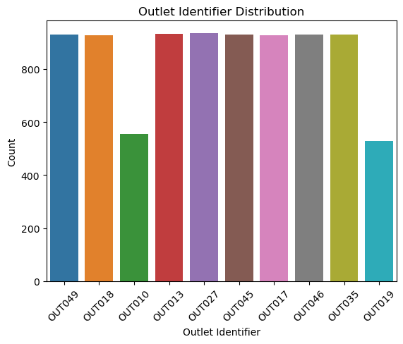
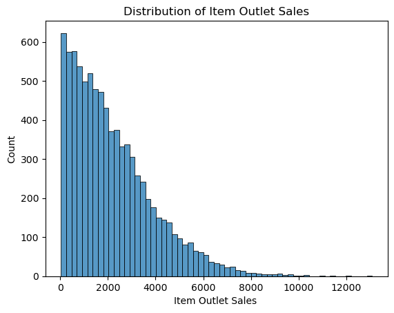
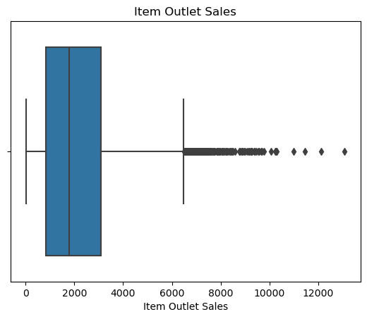
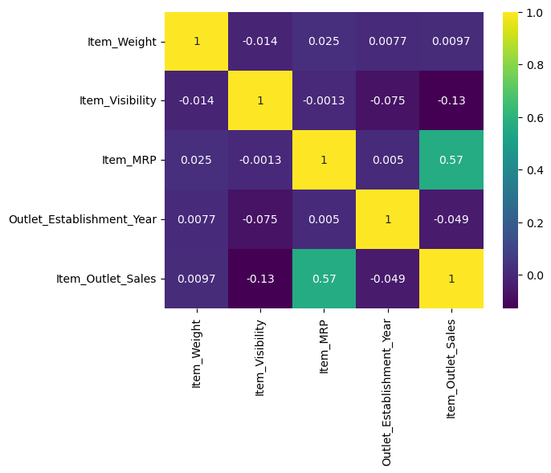
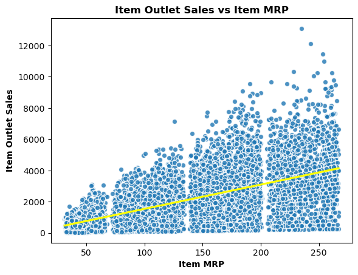
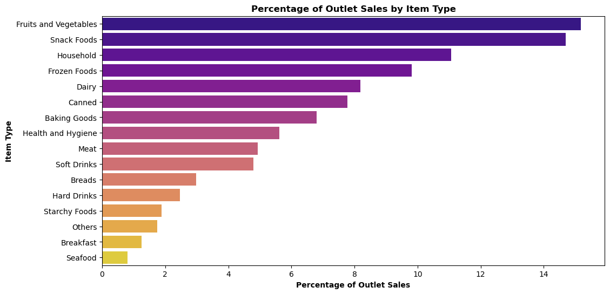
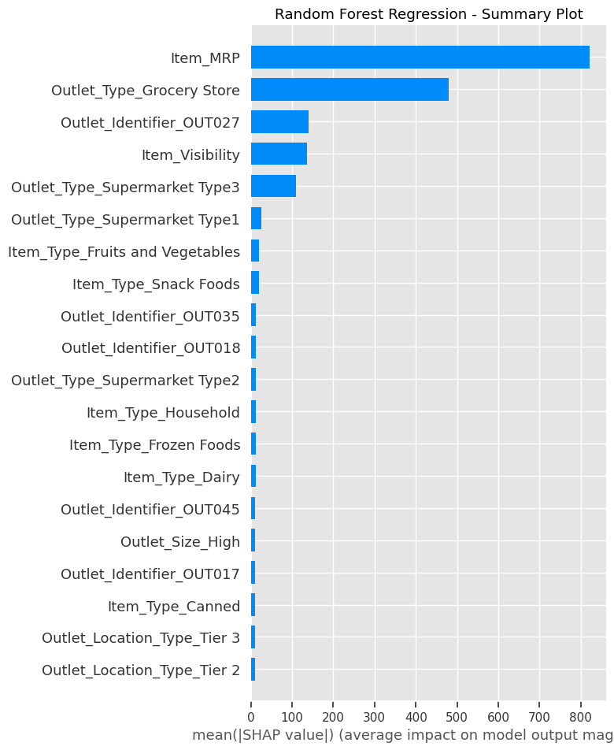
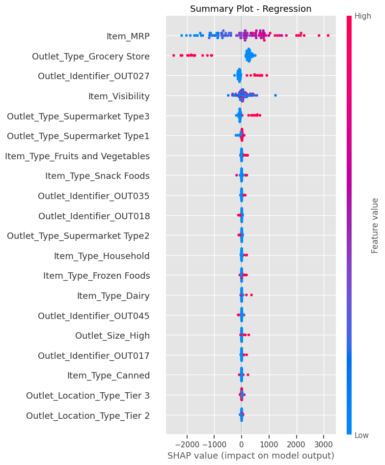
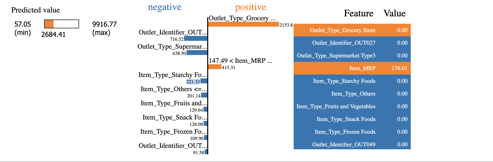
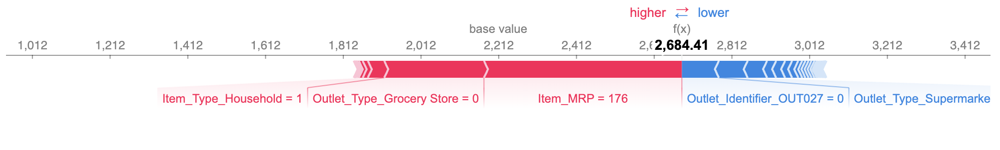

# Prediction-of-Product-Sales

----------------------------------------

# Inspecting Outlet Features to Predict Sales

This project aims to help retailers understand the properties of their products and outlets that play crucial roles in increasing sales. Using data analysis and machine learning techniques, the project will identify the most significant factors that influence sales performance and explore segmentation strategies to group similar products and outlets together. The goal is to provide retailers with a comprehensive understanding of their sales data and enable them to make data-driven decisions that increase revenue, improve customer satisfaction, and drive long-term success. An interactive dashboard will allow retailers to visualize and explore the data, experiment with input parameters, and generate custom reports.

## Data Source: [sales_predictions_2023.csv](https://drive.google.com/file/d/1syH81TVrbBsdymLT_jl2JIf6IjPXtSQw/view)

### Data Dictionary
  - **Item_Identifier**: Unique product ID
  - **Item_Weight**: Weight of product
  - **Item_Fat_Content**: Whether the product is low fat or regular
  - **Item_Visibility**: The percentage of total display area of all products in store allocated to the particular product
  - **Item_Type**: The category to which the product belongs
  - **Item_MRP**: Maximum Retail Price (list price) of the product
  - **Outlet_Identifier**: Unique store ID
  - **Outlet_Establishment_Year**: The year in which store was established
  - **Outlet_Size**: The size of the store in terms of ground area covered
  - **Outlet_Location_Type**: The type of area in which the store is located
  - **Outlet_Type**: Whether the outlet is a grocery store or some sort of supermarket
  - **Item_Outlet_Sales**: Sales of product in particular store. This is the target variable to be predicted

 In order to get the data ready for analysis, we underwent a data cleaning process and executed the following tasks:
## Exploratory Data Analysis (EDA):
Exploratory Data Analysis (EDA) is a foundational approach to data examination and visualization, designed to provide a comprehensive overview of datasets. Its primary objective is to facilitate a deeper understanding of the data, uncover potential patterns and trends, and stimulate the generation of hypotheses. EDA plays a pivotal role as an initial step in the data analysis process, typically carried out before engaging in more advanced modeling or hypothesis testing procedures.

### Categorical Columns
Below is one example of how categorical data was explored using a countplot.

- Interpretation:
  - OUT027 has the highest count of instances.
  - OUT019 has the lowest count of instances.

### Numerical Columns
Below is one example of how numerical data was explored using a histogram and boxplot

- 'Item Outlet Sales' Histogram Interpretation:
  - Values range from 33.29 to 13086.96.
  - The median value is 1794.33.
  - The data is very positively skewed

- 'Item Outlet Sales' Boxplot Interpretation:
  - The data is very positively skewed .
  - Outliers are noted on the high end.
  
### Heatmap of Correlation
Correlation between numeric features was displayed using a heatmap.

- Interpretation of Heatmap:
  - The highest correlation is between Item_MRP and Item_Outlet Sales
  
## Explanatory Data Analysis
Explanatory Data Analysis (EDA) stands as a fundamental method for scrutinizing and portraying datasets, aiming primarily to encapsulate their core attributes. Its primary objective is to foster comprehension of the data, uncover underlying patterns, and inspire the formulation of hypotheses. EDA serves as a pivotal preliminary phase in the data analysis workflow, traditionally conducted prior to delving into more intricate modeling or hypothesis testing procedures.

Ultimately, EDA is a critical step that enables data scientists and analysts to gain insights into their data, make informed decisions about subsequent analysis, and communicate findings effectively to stakeholders. It helps ensure that any conclusions drawn from the data are based on a thorough understanding of its properties and limitations.

Below is a scatterplot showing the Impact of Item MRP on Item Outlet Sales. 

-Prediction: Positive Correlation- Item MRP Influences Item Outlet Sales.

- Prediction: Fruits and Vegetables (15%) exhibit the highest sales, whereas Seafood (0.8%) demonstrates the lowest sales.
    - The top three Items Types to impact most on Item Outlet sales are:
        - Fruits and Vegetables: 15%
        - Snack Foods: 14%
        - Household: 11%
        
# Recommendations
- My examination highlights the demand for convenient and effortless meal options. Incorporating a greater selection of pre-packaged or grab-and-go foods has a positive impact on outlet sales. Additionally, raising the Maximum Retail Price (MRP) of items is associated with increased outlet sales. Ensuring each outlet carries items with a higher MRP is likely to result in higher sales figures.

## Model Performance:
- Model performance in machine learning, for regression tasks, is evaluated using metrics such as Mean Absolute Error (MAE), Mean Squared Error (MSE), Root Mean Squared Error (RMSE), and R-squared (R²) score. MAE measures the average absolute prediction error, while MSE and RMSE consider squared errors, with RMSE providing an interpretable scale. R² quantifies how well the model explains the variance in the target variable, with higher values indicating a better fit. Lower values of MAE, MSE, and RMSE are desirable, while a higher R² score indicates a better model fit. The choice of metric depends on the problem and data characteristics.

### **Overall Model Recommendation**
- Model Performance:
    - Overall, the best model was the Linear Regression Model. This model avoids the bias.
    - The Linear Regression Model performed best giving an R2 score for test data at 56.71%, and the RMSE score for test data at 1092.9153.

# Limitations and Next Steps
- Enhancements to this model could involve a more detailed exploration of item categorization and a closer examination of diverse outlet sizes and identifiers.

## Extracting and Visualizing Coefficients and Feature Importance

### Interpreting Coefficients
- To understand the impact of features on machine learning models, coefficients are extracted and visualized. These coefficients represent the weights assigned to each feature and provide insights into their influence on predictions. Positive coefficients suggest an increase in a feature leads to a higher prediction, while negative coefficients imply the opposite. Visualization techniques such as bar plots help identify which features have the most significant impact, aiding in model interpretation and feature selection.

- Interpreting the Top 3 impactful features and their coefficients
    - `Outlet_Type_Supermarket Type3` feature has a significant positive impact. A Tier 3 outlet will produce 675 revenue for it's outlet. This could mean that having an outlet in a tier 3 location is associated with higher sales and profits.
    - `Outlet_Identifier_OUT27` feature has a significant positive impact. This outlet seems to generate 675 in revenue. 
    - `Outlet_Type_Grocery Store` feature has a significant negative impact. This indicates that Outlets that are categorized as Grocery Stores negatively impact on revenue generated by a value of 876.
    
### Interpreting Feature Importances 
- Feature importances in machine learning quantify the significance of each input variable (feature) in making predictions. They help identify which features have the most influence on the model's output. These importances are typically calculated using techniques like tree-based models (e.g., Random Forest) or gradient boosting. High feature importance indicates a strong contribution to predictions, making it valuable for feature selection, model debugging, and understanding the underlying patterns in the data.

Features with higher importances have a more significant impact on the model's predictions.
- The top 5 most important features for this model are:
    1) Item_MRP: maximum retail price of an item has the highest importance score of 0.464
    2) Outlet Type Grocery Store: has the second highest importance score of 0.192
    3) Item_Visibility: has the third highest importance score of 0.122
    4) Outlet_Type_Supermarket Type3: has the forth highest importance score of 0.0388
    5) Outlet_Identifier_OUT027: has the fifth highest importance score of 0.0387

## Visualizations

### Summary Bar Plot (plot_type='bar')

- The comparison between the key features identified by Shap and the traditional feature importance methods reveals a noteworthy overlap. Both Random Forest Regressor and Shap concur on the significance of `Item_MRP` and `Outlet_Type_Grocery Store`. However, there are some distinctions; while Random Forest Regressor highlights `Item_Visibility`, Shap's model prioritizes `Outlet_Identifier_OUT027`. These disparities may be attributed to the randomization process employed in the Shap model.

### Summary Dot Plot (plot_type='dot')

- Top 3 Features Explained:
    1) `Item_MRP`: The presence of red dots signifies a notably positive SHAP value, suggesting that as the Maximum Retail Price (MRP) of an item rises, the model's predictions for outlet sales also exhibit an upward trend. In other words, higher MRP values correlate with increased sales predictions in the Random Forest model.
    2) `Outlet_Type_Grocery_Store`: Conversely, a strongly negative SHAP value for this feature indicates that when products are sold in "Grocery Store" type outlets, the model anticipates lower sales. Items sold in grocery store outlets appear to have an adverse effect on sales predictions, potentially due to factors such as limited product variety or reduced foot traffic.
    3) `Outlet_Identifier_OUT027`: Conversely, a notably positive SHAP value for this feature points to a substantial boost in sales predictions when products are sold in the outlet identified as "OUT027." This specific outlet seems to exert a unique and positive impact on sales, likely influenced by factors like its location, popularity, or effective marketing strategies.
    
### LIME Tabular Plot
- The LIME Tabular Plot is a visualization tool used in explainable machine learning to understand model predictions. It displays the impact of individual features on a particular prediction made by a machine learning model. Each horizontal bar in the plot represents a feature, and its length indicates the magnitude of its influence on the prediction. Positive contributions are displayed on the right side of the plot, while negative contributions are on the left. By examining this plot, users can gain insights into why a specific prediction was made, helping to interpret and trust the model's decision-making process. The Lime Tabular Plot is valuable for model transparency and debugging in complex machine learning applications.

- This LIME plot illustrates how each feature impacts the prediction for this specific data sample. In the case of this sample, its individual features contribute positively to the prediction, leading to a favorable outcome.
    - Is not a grocery store
    - A low item MRP
- Features that have an adverse (negative) effect on the predicted value:
    - Doesn't carry: 
        - starchy foods
        - fruits and Vegetables
        - Snack Foods
        - Frozen Foods
- Together, these features result in a prediction of 2,684. The progress bar displays the range within which the value can change and the actual prediction.

### Individual Force Plot
- An Individual Force Plot is a visualization tool used in explainable machine learning to depict the influence of individual features on a single prediction. It shows how each feature contributes to either increasing or decreasing the prediction. Each feature is represented as a bar, and its length reflects the magnitude of its effect. Positive contributions extend to the right, while negative ones extend to the left. This plot is valuable for understanding the role of specific features in model predictions, enhancing transparency, and gaining insights into why a particular prediction was made.

- Interpreting Individual Force Plot
    - If a bar is on the right side (the plus side) of the base value (2212), it means the thing we're looking at is making the prediction go up.
        - Base value: 2,212
        - Model Predicted Value: 2684.41
    - In this plot, the bars are on the right side, which means the red features are making the prediction for this sample go up. These specific features are increasing the prediction by 472. 
    - The features that are causing this increase are:
        - Belongs to Outlet_Identifier_OUT018, Outlet_Location_Type_Tier 3, Outlet_Type_Supermarket Type2
        - Is a not a Grocery Store
        
# For Further Information
If you have any questions, feel free to reach out to:

**Medha Patel** (Data Scientist)
    E-mail: ![patelmedzy@gmail.com]

    
