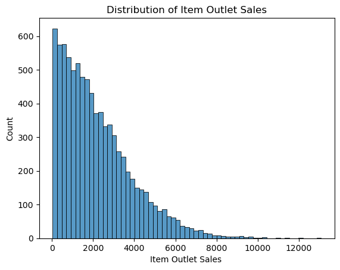

# Prediction-of-Product-Sales

----------------------------------------

# Inspecting Outlet Features to Predict Sales

Our aim is to assist retailers in comprehending the characteristics of both products and outlets that significantly impact sales growth. Our specific objective is to boost the sales of individual items in each outlet. To achieve this, I analyze the attributes that have a significant influence on outlet sales.

## Data Source: [sales_predictions_2023.csv](https://drive.google.com/file/d/1syH81TVrbBsdymLT_jl2JIf6IjPXtSQw/view)

### Data Dictionary
  - **Item_Identifier**: Unique product ID
  - **Item_Weight**: Weight of product
  - **Item_Fat_Content**: Whether the product is low fat or regular
  - **Item_Visibility**: The percentage of total display area of all products in store allocated to the particular product
  - **Item_Type**: The category to which the product belongs
  - **Item_MRP**: Maximum Retail Price (list price) of the product
  - **Outlet_Identifier**: Unique store ID
  - **Outlet_Establishment_Year**: The year in which store was established
  - **Outlet_Size**: The size of the store in terms of ground area covered
  - **Outlet_Location_Type**: The type of area in which the store is located
  - **Outlet_Type**: Whether the outlet is a grocery store or some sort of supermarket
  - **Item_Outlet_Sales**: Sales of product in particular store. This is the target variable to be predicted

 In order to get the data ready for analysis, we underwent a data cleaning process and executed the following tasks:
## Exploratory Data Analysis (EDA):

